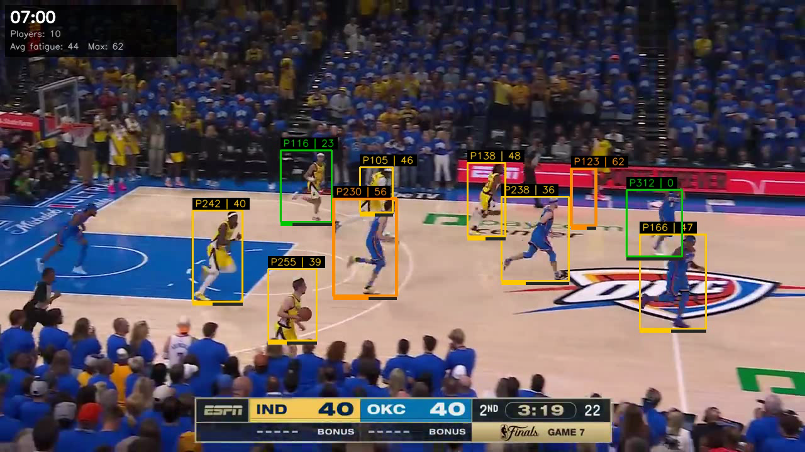
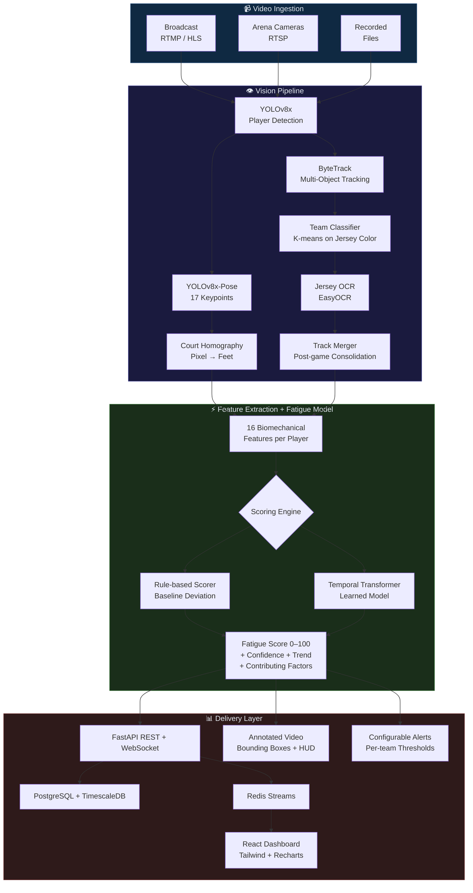

<p align="center">
  
</p>

<h1 align="center">SportsSight</h1>

<p align="center">
  <strong>Real-time fatigue analytics from broadcast video for any sport.</strong><br/>
  Detect player fatigue before it becomes a liability — from any camera feed, any sport, any level.
</p>

<p align="center">
  
  
  
  
</p>

---

## The Problem

Coaches make substitution decisions based on feel. A player's speed drops 15%, their defensive stance gets lazy, their recovery between sprints takes twice as long — but nobody quantifies it in real time. By the time fatigue is visible to the eye, it's already cost you points.

## What SportsSight Does

SportsSight processes game video — broadcast feeds, arena cameras, or recorded footage — and produces **per-player fatigue scores** updated every frame. It tracks 16 biomechanical indicators and alerts coaching staff when players cross configurable fatigue thresholds.

```
Camera Feed → Player Detection → Tracking → Pose Estimation → Biomechanics → Fatigue Model → Dashboard
```

### Works With Any Sport

The core pipeline is sport-agnostic. The computer vision stack (detection, tracking, pose estimation) works on any sport with visible players. Sport-specific modules handle court/field mapping and feature interpretation:

| Sport | Status | Key Metrics |
|-------|--------|-------------|
| **Basketball (NBA)** | Shipped | Sprint speed, defensive stance, jump height, recovery time |
| **Soccer** | Planned | Distance covered, sprint frequency, pressing intensity |
| **Football** | Planned | Snap-to-snap recovery, route sharpness, stance breakdown |
| **Tennis** | Planned | Court coverage, serve speed decay, split-step timing |

Adding a new sport requires: (1) a field/court mapping module, (2) sport-specific feature weights in the fatigue model.

---

## Demo: 2025 NBA Finals

Analyzed 720p broadcast footage of the 2025 NBA Finals (Pacers vs Thunder) — results from real pipeline output:

<p align="center">
  
</p>

| Metric | Value |
|--------|-------|
| Players tracked per frame | 6.7 avg, 17 max |
| Unique players identified | 118 (19 core) |
| Fatigue score range | 0 (fresh) → 88 (critical) |
| Contributing factors per score | 13 active |
| Processing speed | 1:1.5 (12 min video in 18 min on M4 Max) |

### What the Fatigue Score Means

Each player gets a score from **0** (fresh) to **100** (exhausted), computed from deviation against their own first-quarter baseline:

- **0–29 (Low)** — Performing at or near baseline
- **30–54 (Moderate)** — Measurable decline in 2+ indicators  
- **55–74 (High)** — Significant decline — substitution window
- **75–100 (Critical)** — Multiple systems degraded — sub immediately

### 16 Biomechanical Features

| Category | Features |
|----------|----------|
| **Movement** | Speed, acceleration, deceleration, lateral speed, max speed (rolling window) |
| **Stride** | Stride length, stride frequency |
| **Defense** | Defensive stance depth (knee flexion angle), hip drop |
| **Explosiveness** | Jump height, contest frequency |
| **Recovery** | Recovery time (seconds to return to sprint speed after burst), sprint count |
| **Posture** | Torso lean (degrees from vertical), shoulder asymmetry |
| **Distance** | Cumulative distance traveled (feet, via court homography) |

---

## Architecture



---

## Quick Start

### Prerequisites

- Python 3.11–3.13
- PostgreSQL 14+
- Redis 7+
- Node.js 20+ (for dashboard)
- ~500MB disk for ML models

### Setup

```bash
git clone https://github.com/StuckInTheNet/SportsSight.git
cd SportsSight

# Python environment
make dev

# Download ML models (YOLOv8x + YOLOv8x-Pose)
sportssight download-models

# Start infrastructure
docker compose up -d postgres redis
# Or use local installs:
# brew services start postgresql@14 redis

# Copy and configure environment
cp .env.example .env
# Edit .env: set API_SECRET_KEY, DATABASE_URL, etc.
```

### Analyze a Game

```bash
# Process a video file — outputs JSON results + annotated video
sportssight analyze path/to/game.mp4 --game-id my-game -o results.json

# The annotated video (with bounding boxes) is saved alongside:
# path/to/game_annotated.mp4

# Skip video annotation for faster processing:
sportssight analyze path/to/game.mp4 --no-annotate -o results.json
```

### Live Game Processing

```bash
# Process a live RTMP stream
sportssight live rtmp://broadcast.example.com/live/game --game-id live-001

# Process an RTSP camera feed
sportssight live rtsp://arena-camera:554/court1 --game-id live-001 -t rtsp
```

### Dashboard

```bash
# Start the API server
sportssight serve

# Start the React dashboard (separate terminal)
cd dashboard && npm install && npm run dev
# Open http://localhost:3030
```

### Data Acquisition

```bash
# List available training data sources
python scripts/download_data.py list-sources

# Download datasets
python scripts/download_data.py trackid3x3      # Annotated basketball video
python scripts/download_data.py sportvu          # 2015-16 XY tracking data
python scripts/download_data.py roboflow-datasets # Jersey number OCR training
```

---

## Project Structure

```
src/
├── ingestion/              # Video source adapters
│   ├── sources.py          #   FileSource, RTMPSource, RTSPSource
│   └── pipeline.py         #   Multi-source ingestion manager
├── vision/
│   ├── detector.py         # YOLOv8 player detection
│   ├── tracker.py          # ByteTrack multi-object tracking
│   ├── team_classifier.py  # Auto-calibrating team color K-means
│   ├── jersey.py           # EasyOCR jersey number detection
│   ├── reid.py             # Re-ID: team + jersey + appearance
│   ├── pose.py             # YOLOv8-Pose skeleton extraction
│   ├── court.py            # Court homography (pixel → feet)
│   ├── track_merger.py     # Post-game identity consolidation
│   ├── annotator.py        # Bounding box + fatigue video overlay
│   └── pipeline.py         # Vision pipeline orchestrator
├── features/
│   └── extractor.py        # 16 biomechanical features
├── models/
│   └── fatigue.py          # Temporal transformer + rule-based scoring
├── realtime/
│   ├── engine.py           # Stream processor (threaded inference)
│   └── alerts.py           # Configurable fatigue alerts
├── api/
│   ├── app.py              # FastAPI REST + WebSocket + video serving
│   ├── auth.py             # API key auth with RBAC
│   └── database.py         # PostgreSQL models (multi-tenant)
└── cli.py                  # CLI: analyze, live, serve, download-models

dashboard/                  # React 19 + TypeScript + Tailwind 4 + Recharts
configs/                    # Pipeline parameters + team rosters
scripts/                    # Data acquisition + game loading
tests/                      # 93 tests (unit + integration)
```

## Tech Stack

| Layer | Technology |
|-------|-----------|
| **Detection** | YOLOv8x (Ultralytics) |
| **Tracking** | ByteTrack (two-stage association) |
| **Pose** | YOLOv8x-Pose (COCO 17-keypoint) |
| **Re-ID** | Team color K-means + EasyOCR + torchreid (optional) |
| **Court Mapping** | OpenCV Hough lines + RANSAC homography |
| **Fatigue Model** | PyTorch temporal transformer + rule-based fallback |
| **API** | FastAPI (async, WebSocket native) |
| **Database** | PostgreSQL + TimescaleDB |
| **Stream Processing** | Redis Streams |
| **Dashboard** | React 19, Tailwind CSS 4, Recharts |
| **Inference** | Apple MPS / NVIDIA CUDA / CPU |

---

## Adding a New Sport

1. **Court/field module** — Create `src/vision/field_soccer.py` (or similar) with field dimensions and line detection logic
2. **Detection filters** — Adjust aspect ratio and min area thresholds in config for the sport's player appearance
3. **Feature weights** — Update `FatigueModel._score_rule_based()` weights to reflect which biomechanical signals matter most for the sport
4. **Roster config** — Add team roster JSON to `configs/rosters/`
5. **Config preset** — Add a YAML config preset in `configs/` with sport-specific parameters

See [CONTRIBUTING.md](CONTRIBUTING.md) for detailed guidance.

---

## Development

```bash
make test           # 93 tests, ~4 seconds
make test-cov       # With coverage report
make lint           # Ruff linter
make typecheck      # Mypy strict mode
make format         # Auto-format
```

## API Reference

| Endpoint | Method | Description |
|----------|--------|-------------|
| `/health` | GET | Liveness probe |
| `/teams` | POST | Create team (requires admin secret) |
| `/teams/me` | GET | Get current team info |
| `/players` | GET/POST | List or create players |
| `/games` | GET/POST | List or create games |
| `/games/{id}/fatigue` | GET | Fatigue records (filterable by player, time range) |
| `/games/{id}/alerts` | GET | Fatigue alerts for a game |
| `/games/{id}/live` | WS | Real-time fatigue stream (WebSocket) |
| `/players/{id}/fatigue-history` | GET | Cross-game fatigue trends |
| `/alerts/configure` | POST | Update alert thresholds |
| `/video` | GET | List available video files |
| `/video/{filename}` | GET | Stream video file |

All endpoints (except `/health` and `/teams` POST) require `X-API-Key` header.

---

## Roadmap

- [ ] **Transformer training pipeline** — Train `FatigueTransformer` on SportVU data for learned fatigue scoring
- [ ] **Soccer support** — Field mapping, distance-based fatigue, pressing metrics
- [ ] **Jersey number fine-tuning** — Train YOLOv8 on Roboflow jersey OCR dataset for reliable player identification
- [ ] **torchreid integration** — OSNet appearance embeddings for stronger cross-cut re-identification
- [ ] **Real-time inference optimization** — TensorRT/ONNX export for sub-second latency
- [ ] **Game report export** — PDF/HTML post-game fatigue reports with charts and recommendations
- [ ] **Historical player modeling** — Cross-game fatigue baselines that adapt to individual player physiology

## License

MIT — see [LICENSE](LICENSE).
